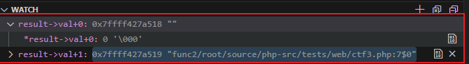
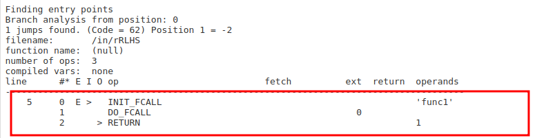
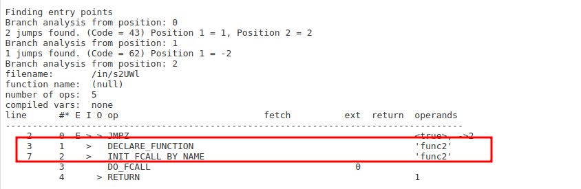

# Overview

In this blog we will do some small php source code reviews in which you will hopefully learn something new and someday apply it. While writing the challenge soultions I will try to write out also some of my thinking process. We will start out first with the easiest (in my oppinion) challenge and end with the hardest one. Taking notes can be really helpful when doing anything, if you want you can take notes while reading this blog. Also my recommendation is to first try out the challenges and then read the blog post. Enjoy!

There will be three challenges, the first two are warmups for the 3rd one haha:

- Challenge 1 -> Easy
- Challenge 2 -> Easy
- Challenge 3 -> Insane++

## Challenge 1

In this challenge we were supposed to bypass waf which detects all bad characters which could help us in SQL Injection. At first sight it seemed immposible to bypass...

```php
 <?php error_reporting(0);
require 'config.php';

class db extends Connection {
    public function waf($s) {
        if (preg_match_all('/'. implode('|', array(
            '[' . preg_quote("(*<=>|'&-@") . ']',
            'select', 'and', 'or', 'if', 'by', 'from', 
            'where', 'as', 'is', 'in', 'not', 'having'
        )) . '/i', $s, $matches)) die(var_dump($matches[0]));
        return json_decode($s);
    }

    public function query($sql) {
        $args = func_get_args();
        unset($args[0]);
        return parent::query(vsprintf($sql, $args));
    }
}

$db = new db();

if ($_SERVER['REQUEST_METHOD'] == 'POST') {
    $obj = $db->waf(file_get_contents('php://input'));
    $db->query("SELECT note FROM notes WHERE assignee = '%s'", $obj->user);
} else {
    die(highlight_file(__FILE__, 1));
}
?> 
```
My first thought was maybe there was some regex misconfig, no luck on that one. What I like to do when doing a php challenge is that I research every php method that is being used and read its research. In this particular challenge I could figure out why json_decode() was being used, after doing some research I found out that json_decode() can also decode unicode. Nice! The bypass is fairly simple. I just unicoded my payload (simple sqli) and passed it to the php app. It worked first try :) . 


## Challenge 2

Next challenge is a little bit harder than the last one, but can still be solved just by doing some basic research.

```php
<?php

function runme() {
    if (isset($_GET['formula'])) {
        $formula = $_GET['formula'];
        if (strlen($formula) >= 150 || preg_match('/[a-z\'"]+/i', $formula)) {
            return 'Try Harder !';
        }
        try {
            eval('$calc = ' . $formula . ';');
            return isset($calc) ? $calc : '?';
        } catch (ParseError $err) {
            return 'Error';
        }
    }
}

$result = runme();
echo "Result: " . $result;

?>
``` 
The code here being short kinda makes it easy to read, but not as easy to solve... I honestly was just kinda banging my head around on using this eval() function to somehow get RCE but the regex was stoping me everytime. After reading out on some of my notes on HTB retired challenges I found out a similar challenge called __pcalc__ on hackthebox that I solved recently. Where I bypassed the same regex as here (the challenge was actually pretty much the same, even the eval sink). The bypass was to use the other way to delimit strings in php called [**Heredoc**](https://www.php.net/manual/en/language.types.string.php#language.types.string.syntax.heredoc) and [**Nowdoc**](https://www.php.net/manual/en/language.types.string.php#language.types.string.syntax.nowdoc). Also in the same docs you can see that you can use octal notation for characters which is exactly what we need so we can use letters without actually using them :) . I solved this using a script but you can do it manually.

```python
command = "yourCmdHere"
octal_bytes = [format(ord(char), 'o') for char in command]
octal_bytes_string = '\\'.join(octal_bytes)
print(f'`\\{octal_bytes_string}`')
```
This script converts your command to octal notation, now all that is left to do is add <<<_ on the start of your quoted string and finish it with _>>>. For example 

```php
<<<_\145\170\145\143_>>>(<<<_\154\163_>>>)
```

After the php does its decoding behind the scene the passed payload will look like : exec("ls") 

# Challenge 3
This challenge was on Serbian Cybersecurity Challenge finals in Belgrade. It was a pretty tough one that I did not solve on the ctf and I spent most of the time on it but sadly it was a mistake and I didn't really get to do much of the other challenges...

```php
<?php
require_once _DIR_ '/flag.php';
require_once _DIR__ . '/test.php';

$secret trim($_REQUEST['secret'] ?? 'test1');
$secrets = trim($_REQUEST['secrets'] ?? 'picture');
function picture() 
{ echo "";}

$secretCheck = strcasecmp(hash('sha512', $secret), '1811d2105f3bbf78946a730955772056e472fa2737a28f840f822c2ca167f99e'); $comparisonResult = $secretCheck? 'match': 'no_match';
switch ($comparisonResult) {
    case 'match':
        function getsecret(){
            echo TEST;
        }
        function getsecret(){
            echo TEST;
            echo SECRET;
        }
        break;
    case 'no_match':
    function getsecret(){ 
        echo TEST;
    }
    break;
}

$secrets();

?>
```
Most of the time I was focusing on the $secretCheck variable and trying to bypass somehow the hash check etc... I even cracked the hash but the problem was it was comparing 512 byte hash with 256 hash. The solution was in the core of compiling and executing PHP scripts. Php uses Zend Virtual machine to compile the instructions and execute them. When PHP compiles the function that in this case is defined by a user, it uses  `zend_compile_func_decl` function (if you want to see the source youself you can navigate to PHP Source Code repo on github):

```php
void zend_compile_func_decl(znode *result, zend_ast *ast, zend_bool toplevel) /* {{{ */
{

    zend_ast_decl *decl = (zend_ast_decl *) ast;
    zend_bool is_method = decl->kind == ZEND_AST_METHOD;
    if (is_method) {
        zend_bool has_body = stmt_ast != NULL;
        zend_begin_method_decl(op_array, decl->name, has_body);
    } else {
        zend_begin_func_decl(result, op_array, decl, toplevel);
        if (decl->kind == ZEND_AST_ARROW_FUNC) {
            find_implicit_binds(&info, params_ast, stmt_ast);
            compile_implicit_lexical_binds(&info, result, op_array);
        } else if (uses_ast) {
            zend_compile_closure_binding(result, op_array, uses_ast);
        }
    }
}
```

- Opline in PHP is the process of source code being compiled in Zend Virtual Machine instructions. Kinda like how processor on you computer works, he gets instructinons in his own language to execute (sadly cpu doesn't understand english :/ ) .

- Invocation of `zendparse` to execute lexical analysis, syntax analysis, and construct the Abstract Syntax Tree (AST). This step is like breaking down a sentence into individual words and understanding their meanings. So, it's breaking down the code into smaller parts and figuring out what each part does. It's like understanding the structure of a sentence.

- Utilization of `init_op_array` for `zend_compile_top_stmt` to finalize the conversion of AST into the opline array. Think of this as organizing those individual words into a meaningful order, just like arranging words into a proper sentence. Here, we're taking the smaller parts of the code and putting them together in a way that the computer can understand and execute efficiently.

- Application of `pass_two` to conclude the translation of compile-time details to runtime data and to designate the appropriate handler for each opcode. Once we have the sentence (or code) structured properly, this step is like adding extra information to make sure everything works smoothly when the code runs. It's like adding punctuation marks and instructions for how each part of the sentence should be spoken or acted upon. 

(I hope I explained it so even if you are totally new you can understand :D)

When PHP compiles the "function definition" it uses `zend_compile_fund_decl` function:

```php
void zend_compile_func_decl(znode *result, zend_ast *ast, zend_bool toplevel) /* {{{ */
{
    ...
    zend_ast_decl *decl = (zend_ast_decl *) ast;
    zend_bool is_method = decl->kind == ZEND_AST_METHOD;
    if (is_method) {
        zend_bool has_body = stmt_ast != NULL;
        zend_begin_method_decl(op_array, decl->name, has_body);
    } else {
        zend_begin_func_decl(result, op_array, decl, toplevel);
        if (decl->kind == ZEND_AST_ARROW_FUNC) {
            find_implicit_binds(&info, params_ast, stmt_ast);
            compile_implicit_lexical_binds(&info, result, op_array);
        } else if (uses_ast) {
            zend_compile_closure_binding(result, op_array, uses_ast);
        }
    }
}
```

In this function you can see there is a argument being used called `toplevel`, which in tihs code it checks if the current function is in the top-level scope. The next code is the one that processes normal functions `zend_begin_func_decl`:

```php
static void zend_begin_func_decl(znode *result, zend_op_array *op_array, zend_ast_decl *decl, zend_bool toplevel) /* {{{ */
{
    ...
    zend_register_seen_symbol(lcname, ZEND_SYMBOL_FUNCTION);
    if (toplevel) {
        if (UNEXPECTED(zend_hash_add_ptr(CG(function_table), lcname, op_array) == NULL)) {
            do_bind_function_error(lcname, op_array, 1);
        }
        zend_string_release_ex(lcname, 0);
        return;
    }

    /* Generate RTD keys until we find one that isn't in use yet. */
    key = NULL;
    do {
        zend_tmp_string_release(key);
        key = zend_build_runtime_definition_key(lcname, decl->start_lineno);
    } while (!zend_hash_add_ptr(CG(function_table), key, op_array));

    ...
}
```

If `toplevel` returns true, it will enter the first statement where it declares the function name to the function table. But if `toplevel` is false, it will enter the do while loop and will use `zend_build_runtime_definition_key` function where it will generate a key that will be added to the functions name to the function table.

In simpler words, `toplevel` just checks if the scope of the function is "toplevel" or nested, like here:

```php
<?php
function iAmTopLevel(){
    echo 'toplevel';
}

function func1(){ //or anything else taht will make the following function nested
    function func2(){
        echo 'i am nested func that is not top level';
    }
}
...
```

When the toplevel function is being compiled it will just pass the `lcname` as the function name to the function table which is `iAmTopLevel` in this case

But when `func2` function is executed, it will enter the do while and will add a generated key by `zend_build_runtime_definition_key` function :



As you can see here, it gives the function name is not `func2` as it is supposed to be, now it is being defined in the functions table as `\0func2/root/source/php-src/tests/web/ctf3.php:7$0` which means the key that was generated was added to the func name.

The key is generated in this way:

```
'\0' + functionName + filenamePath + ':' function_line_number (which is line 7 in our case) + '$' + rtd_key_counter ( which is a global counter that increases by 1 everytime its used, starting from 0)
```

## Differences in opline

We will check the difference between the two functions in opline using vld exstension, you can use the online [vld](https://3v4l.org/rRLHS/vld) exstension

Oplines of the following code are:

```php
<?php
function func1() {
    echo 'func1';
}
func1();
```



The opcode here is only `INIT_FCALL` which intializes and `DO_FCALL` which is used to execute the funcition.

For the "non" `toplevel` function, the opline looks like this:

```php
<?php
if (true) {
    function func2() {
        echo 'func2';
    }
}
func2();
```



The difference here is that there is an opcode for defining a function `DECLARE_FUNCTION` and then after that there is a `INIT_FCALL_BY_NAME` instead of `INIT_FCALL`

This means that when PHP is compiling a non top-level function, the function name and the generated key will be stored in `DECLARE_FUNCTION` . When `DECLARE_FUNCTION` is executed, the original function name will be placed in the function table.

If the scope is not a top level function, the function name (in a non top level format name) will be put into the function table during the compilation phase, and the real function name will be put into function table in the processor during the execution phase. 

So to solve this challenge you figre out the `zend_build_runtime_definition_key` generated key (using the algorithm from above) and send it as a function name.

The problem with this idea is that there was a `trim` function being used in the code

```php
$secret trim($_REQUEST['secret'] ?? 'test1');
$secrets = trim($_REQUEST['secrets'] ?? 'picture');
```
So if I used this as a payload:
```
secret=%00readflag/root/scc/phpChal/insane.php:17$0
```
It would trim the `%00` part and the payload would not work because trim removes whitespaces from the payload in our case nullbyte..

The key is to add `\` before `%00`. 

Because in the dynamic function call is `INIT_DYNAMI_CALL` (you can see this using vld). Then using that you find the handler in the PHP source code. In the source code it is written that if the function name is a string, it will execute a `zend_init_dynamic_call_string` function:

```php
static zend_never_inline zend_execute_data *zend_init_dynamic_call_string(zend_string *function, uint32_t num_args) /* {{{ */
{
    if ((colon = zend_memrchr(ZSTR_VAL(function), ':', ZSTR_LEN(function))) != NULL &&
        colon > ZSTR_VAL(function) &&
        *(colon-1) == ':'
    ) {
        ...
    } else {
        if (ZSTR_VAL(function)[0] == '\\') {
            lcname = zend_string_alloc(ZSTR_LEN(function) - 1, 0);
            zend_str_tolower_copy(ZSTR_VAL(lcname), ZSTR_VAL(function) + 1, ZSTR_LEN(function) - 1);
        } else {
            lcname = zend_string_tolower(function);
        }
```

In the else statement you can see there is a check if the first character of the function name is a `\` , and if it is remove it and then search in the function table.

Basically the point is to remove the backslash of the root namespace. All internal function can be called with a `\`, for example `\date()` would still call the date function.

So the final payload would look like:

```
secret=%00readflag/root/scc/phpChal/insane.php:17$0
```

But... there is a one more catch, the `$0` part at the end is a counter right? Which means everytime the function is called it adds up one to the counter. You can solve this just by bruteforcing the `$0` part :) .


In the new php patch 8.1 they deleted `zend_begin_func_decl` logic completely. But, `zend_build_runtime_definition_key` function has not been deleted and is still there. So when defining a non top-level domain this function will still generate a temproray class name and generate the key. Which also creates a similar but new kind of problem :D .

This challenge was INSANELY HARD and got only 1 solve from my friend DreyAnd :) . I think this stuff should not be on ctfs except if its some insane level ctf's then I understand... But using this challenge on Serbian Competition :) . It was more find the blog than find the flag.

## FINISH LINE!

Thank you for reading my blog post on some of the PHP challenges. I hope you liked it and learned something from it. You can bookmark my blog and check it out once in a while, I will be trying to post something every week or after every ctf I play. 


[Resource](https://www.leavesongs.com/PENETRATION/php-challenge-2023-oct.html)